# Algorithm Catalog

Complete reference of all algorithms implemented in YogEx, organized by category.

## Pathfinding

| Algorithm | Module | Purpose | Time Complexity | Space Complexity |
|-----------|--------|---------|-----------------|------------------|
| Dijkstra | `Yog.Pathfinding.Dijkstra` | Single-source shortest path (non-negative weights) | O((V+E) log V) | O(V) |
| A* | `Yog.Pathfinding.AStar` | Heuristic-guided shortest path | O((V+E) log V) | O(V) |
| Bellman-Ford | `Yog.Pathfinding.BellmanFord` | Shortest path with negative weights, cycle detection | O(VE) | O(V) |
| Floyd-Warshall | `Yog.Pathfinding.FloydWarshall` | All-pairs shortest paths | O(V³) | O(V²) |
| Johnson's | `Yog.Pathfinding.Johnson` | All-pairs shortest paths in sparse graphs | O(V² log V + VE) | O(V²) |
| Bidirectional Dijkstra | `Yog.Pathfinding.Bidirectional` | Faster single-pair shortest path | O((V+E) log V) | O(V) |
| Bidirectional BFS | `Yog.Pathfinding.Bidirectional` | Unweighted shortest path | O(V+E) | O(V) |
| Yen's K-Shortest | `Yog.Pathfinding.Yen` | k shortest loopless paths | O(k·N·(E+V log V)) | O(kV) |
| Widest Path | `Yog.Pathfinding` | Maximum bottleneck capacity path | O((V+E) log V) | O(V) |
| Unweighted SSSP | `Yog.Pathfinding` | BFS shortest path (no heap) | O(V+E) | O(V) |
| Brandes SSSP | `Yog.Pathfinding.Brandes` | Single-source dependency accumulation | O(VE) | O(V²) |
| Chinese Postman | `Yog.Pathfinding.ChinesePostman` | Shortest route visiting every edge | O(V³) | O(V²) |
| LCA (Binary Lifting) | `Yog.Pathfinding.LCA` | Lowest common ancestor in trees | O(V log V) preprocess, O(log V) query | O(V log V) |
| Path Utilities | `Yog.Pathfinding.Path` | Path reconstruction and manipulation | O(V) | O(V) |
| Distance Matrix | `Yog.Pathfinding.Matrix` | Matrix-based distance operations | O(V²) | O(V²) |
| All-Pairs Unweighted | `Yog.Pathfinding` | Parallel BFS all-pairs shortest paths | O(V(V+E)) | O(V²) |
| Suurballe's | `Yog.Pathfinding.Disjoint` | Finds two edge-disjoint shortest paths of minimum total cost | O((V+E) log V) | O(V) |

## Flow & Cuts

| Algorithm | Module | Purpose | Time Complexity | Space Complexity |
|-----------|--------|---------|-----------------|------------------|
| Edmonds-Karp | `Yog.Flow.MaxFlow` | Maximum flow (BFS augmenting paths) | O(VE²) | O(V+E) |
| Dinic's | `Yog.Flow.MaxFlow` | Maximum flow (blocking flow) | O(V²E) | O(V+E) |
| Push-Relabel | `Yog.Flow.MaxFlow` | Maximum flow (preflow-push) | O(V²√E) | O(V+E) |
| Successive Shortest Path | `Yog.Flow.SuccessiveShortestPath` | Min-cost max-flow | O(F · E log V) | O(V+E) |
| Network Simplex | `Yog.Flow.NetworkSimplex` | Minimum cost flow (large instances) | Empirically near-polynomial; worst-case exponential | O(V+E) |
| Stoer-Wagner | `Yog.Flow.MinCut` | Global minimum cut | O(V³) | O(V²) |
| Karger-Stein | `Yog.Flow.MinCut` | Randomized global minimum cut | O(V² log³ V) | O(V+E) |
| Gomory-Hu Tree | `Yog.Flow.MinCut` | All-pairs minimum cuts | O(V · MaxFlow) | O(V+E) |

## Spanning Tree

| Algorithm | Module | Purpose | Time Complexity | Space Complexity |
|-----------|--------|---------|-----------------|------------------|
| Kruskal's | `Yog.MST` | MST via edge sorting | O(E log E) | O(V) |
| Prim's | `Yog.MST` | MST via vertex growing | O(E log V) | O(V) |
| Borůvka's | `Yog.MST` | Parallel MST | O(E log V) | O(V) |
| Edmonds' | `Yog.MST` | Minimum Spanning Arborescence (Directed) | O(VE) | O(V) |
| Wilson's | `Yog.MST` | Uniform Spanning Tree (Probabilistic) | O(V) hit time | O(V) |
| **Max Spanning Tree** | `Yog.MST` | Maximum weight tree | O(E log E) | O(V) |

## Matching

| Algorithm | Module | Purpose | Time Complexity | Space Complexity |
|-----------|--------|---------|-----------------|------------------|
| Hopcroft-Karp | `Yog.Matching` | Maximum bipartite matching | O(E√V) | O(V) |
| Hungarian | `Yog.Matching` | Minimum/maximum weighted bipartite matching | O(V³) | O(V²) |
| Blossom | `Yog.Matching` | Maximum matching in general graphs | O(V³) | O(V²) |

## Connectivity & Components

| Algorithm | Module | Purpose | Time Complexity | Space Complexity |
|-----------|--------|---------|-----------------|------------------|
| Tarjan's SCC | `Yog.Connectivity` | Strongly connected components | O(V+E) | O(V) |
| Kosaraju's SCC | `Yog.Connectivity` | Strongly connected components (two-pass) | O(V+E) | O(V) |
| Connected Components | `Yog.Connectivity` | Undirected connected components | O(V+E) | O(V) |
| Weakly Connected Components | `Yog.Connectivity.Components` | Directed graph components (ignore direction) | O(V+E) | O(V) |
| Tarjan's Bridges | `Yog.Connectivity.Analysis` | Bridge edges | O(V+E) | O(V) |
| Tarjan's Articulation | `Yog.Connectivity.Analysis` | Articulation points | O(V+E) | O(V) |
| K-Core | `Yog.Connectivity.KCore` | Core decomposition | O(V+E) | O(V) |
| Reachability Exact | `Yog.Connectivity.Reachability` | Ancestor/descendant counting | O(V+E) | O(V²) |
| Reachability HLL | `Yog.Connectivity.Reachability` | HyperLogLog reachability estimation | O(V+E) | O(V) |

## Centrality Measures

| Algorithm | Module | Purpose | Time Complexity | Space Complexity |
|-----------|--------|---------|-----------------|------------------|
| Degree Centrality | `Yog.Centrality` | Simple connectivity importance | O(V+E) | O(V) |
| Closeness Centrality | `Yog.Centrality` | Distance-based importance | O(VE + V² log V) | O(V) |
| Harmonic Centrality | `Yog.Centrality` | Distance-based (handles infinite) | O(VE + V² log V) | O(V) |
| Betweenness Centrality | `Yog.Centrality` | Bridge/gatekeeper detection | O(VE) or O(V³) | O(V²) |
| PageRank | `Yog.Centrality` | Link-quality importance | O(k(V+E)) | O(V) |
| HITS | `Yog.Centrality` | Hub and authority scores | O(k(V+E)) | O(V) |
| Eigenvector Centrality | `Yog.Centrality` | Influence from neighbors | O(k(V+E)) | O(V) |
| Katz Centrality | `Yog.Centrality` | Attenuated influence propagation | O(k(V+E)) | O(V) |
| Alpha Centrality | `Yog.Centrality` | External influence model | O(k(V+E)) | O(V) |

## Community Detection

| Algorithm | Module | Purpose | Time Complexity | Space Complexity |
|-----------|--------|---------|-----------------|------------------|
| Louvain | `Yog.Community.Louvain` | Modularity optimization | O(E log V) | O(V) |
| Leiden | `Yog.Community.Leiden` | Quality-guaranteed communities | O(E log V) | O(V) |
| Label Propagation | `Yog.Community.LabelPropagation` | Very large graphs, speed | O(kE) | O(V) |
| Walktrap | `Yog.Community.Walktrap` | Random-walk communities | O(V² log V) | O(V²) |
| Infomap | `Yog.Community.Infomap` | Information-theoretic | O(kE) | O(V) |
| Girvan-Newman | `Yog.Community.GirvanNewman` | Hierarchical edge betweenness | O(E²V) | O(V²) |
| Clique Percolation | `Yog.Community.CliquePercolation` | Overlapping communities | O(3^(V/3)) | O(V²) |
| Fluid Communities | `Yog.Community.FluidCommunities` | Exact k partitions | O(kE) | O(V) |
| Local Community | `Yog.Community.LocalCommunity` | Seed expansion | O(S × E_S) | O(S) |

## Community Metrics

| Algorithm | Module | Purpose | Time Complexity | Space Complexity |
|-----------|--------|---------|-----------------|------------------|
| Transitivity | `Yog.Community.Metrics` | Global clustering coefficient | O(Δ²E) | O(V) |
| Local Clustering Coefficient | `Yog.Community` | Per-node clustering coefficient | O(Δ²E) | O(V) |
| Average Clustering Coefficient | `Yog.Community` | Global average clustering | O(Δ²E) | O(V) |
| Triangle Count | `Yog.Community` | Global or per-node triangles | O(Δ²E) | O(V) |
| Community Density | `Yog.Community` | Per-community edge density | O(E) | O(V) |
| Modularity | `Yog.Community` | Partition quality score | O(E) | O(V) |

## Traversal & Search

| Algorithm | Module | Purpose | Time Complexity | Space Complexity |
|-----------|--------|---------|-----------------|------------------|
| BFS | `Yog.Traversal` | Breadth-first exploration | O(V+E) | O(V) |
| DFS | `Yog.Traversal` | Depth-first exploration | O(V+E) | O(V) |
| Topological Sort | `Yog.Traversal` | DAG vertex ordering | O(V+E) | O(V) |
| Find Path | `Yog.Traversal` | Any path between nodes | O(V+E) | O(V) |
| Implicit Search | `Yog.Traversal.Implicit` | On-demand graph traversal | O((V+E) log V) | O(V) |
| Kahn's Algorithm | `Yog.Traversal.Sort` | Topological sort (BFS-based) | O(V+E) | O(V) |
| Lexicographical TopSort | `Yog.Traversal.Sort` | Deterministic topological ordering | O((V+E) log V) | O(V) |
| Best-First Walk | `Yog.Traversal.Walk` | Priority-guided traversal | O((V+E) log V) | O(V) |
| Random Walk | `Yog.Traversal.Walk` | Stochastic path exploration | O(k) | O(1) |
| BFS Path | `Yog.Traversal.Walk` | BFS shortest path between nodes | O(V+E) | O(V) |

## Graph Transformations

| Algorithm | Module | Purpose | Time Complexity | Space Complexity |
|-----------|--------|---------|-----------------|------------------|
| Transpose | `Yog.Transform` | Reverse edge directions | O(1) | O(1) |
| Subgraph | `Yog.Transform` | Induced subgraph by node IDs | O(V+E) | O(V+E) |
| Ego Graph | `Yog.Transform` | k-hop neighborhood subgraph | O(V+E) | O(V+E) |
| Transitive Closure | `Yog.Transform` | Reachability matrix | O(V³) | O(V²) |
| Transitive Reduction | `Yog.Transform` | Minimal equivalent DAG | O(V³) | O(V²) |
| Quotient Graph | `Yog.Transform` | Partition-based contraction | O(V+E) | O(V+E) |
| Contract | `Yog.Transform` | Merge two nodes | O(deg(u)+deg(v)) | O(V+E) |
| Filter Nodes | `Yog.Transform` | Predicate-based subgraph | O(V+E) | O(V+E) |
| Filter Edges | `Yog.Transform` | Predicate-based edge removal | O(E) | O(E) |

## Graph Properties

| Algorithm | Module | Purpose | Time Complexity | Space Complexity |
|-----------|--------|---------|-----------------|------------------|
| Bipartite Check | `Yog.Property.Bipartite` | 2-colorability test | O(V+E) | O(V) |
| Bipartite Partition | `Yog.Property.Bipartite` | Two-color assignment | O(V+E) | O(V) |
| Max Bipartite Matching | `Yog.Property.Bipartite` | Maximum matching | O(VE) | O(V) |
| Stable Marriage | `Yog.Property.Bipartite` | Gale-Shapley stable matching | O(V²) | O(V) |
| Acyclicity Test | `Yog.Property.Cyclicity` | Cycle detection | O(V+E) | O(V) |
| Eulerian Circuit | `Yog.Property.Eulerian` | Eulerian cycle existence | O(V+E) | O(V) |
| Eulerian Path | `Yog.Property.Eulerian` | Eulerian path existence | O(V+E) | O(V) |
| Bron-Kerbosch | `Yog.Property.Clique` | All maximal cliques | O(3^(V/3)) | O(V) |
| Max Clique | `Yog.Property.Clique` | Largest clique | O(3^(V/3)) | O(V) |
| Complete Graph | `Yog.Property.Structure` | Kₙ detection | O(V²) | O(1) |
| Tree Check | `Yog.Property.Structure` | Tree verification | O(V+E) | O(V) |
| Forest Check | `Yog.Property.Structure` | Disjoint trees | O(V+E) | O(V) |
| Branching Check | `Yog.Property.Structure` | Directed forest | O(V+E) | O(V) |
| Planarity Test | `Yog.Property.Structure` | Exact LR-test planarity | O(V²) | O(V) |
| Planar Embedding | `Yog.Property.Structure` | Combinatorial embedding | O(V²) | O(V) |
| Kuratowski Witness | `Yog.Property.Structure` | Non-planar subgraph | O(V²) | O(V) |
| Chordality Test | `Yog.Property.Structure` | Chordal graph verification | O(V+E) | O(V) |
| Graph Coloring | `Yog.Property.Coloring` | Greedy and exact coloring | O(V²)–O(V!) | O(V) |
| Tree Decomposition | `Yog.Property.TreeDecomposition` | Validity checking and construction | O(V²)–O(V³) | O(V²) |
| Isomorphism | `Yog.Property` | Weisfeiler-Lehman equality | O(k(V+E)) | O(V) |
| Graph Hash | `Yog.Property` | Structural fingerprint | O(k(V+E)) | O(V) |

## DAG Algorithms

| Algorithm | Module | Purpose | Time Complexity | Space Complexity |
|-----------|--------|---------|-----------------|------------------|
| Longest Path | `Yog.DAG.Algorithm` | Critical path in weighted DAG | O(V+E) | O(V) |
| Shortest Path | `Yog.DAG.Algorithm` | Shortest path in DAG | O(V+E) | O(V) |
| Transitive Closure | `Yog.Transform` | Reachability matrix | O(V³) | O(V²) |
| Transitive Reduction | `Yog.Transform` | Minimal equivalent DAG | O(V³) | O(V²) |
| LCA | `Yog.Pathfinding.LCA` | Lowest common ancestors | O(V log V) preprocess, O(log V) query | O(V log V) |
| Topological Generations | `Yog.DAG` | Layer-by-layer ordering | O(V+E) | O(V) |
| Sources | `Yog.DAG` | In-degree 0 nodes | O(V+E) | O(V) |
| Sinks | `Yog.DAG` | Out-degree 0 nodes | O(V+E) | O(V) |
| Ancestors | `Yog.DAG` | All ancestors of a node | O(V+E) | O(V) |
| Descendants | `Yog.DAG` | All descendants of a node | O(V+E) | O(V) |
| Single-Source Distances | `Yog.DAG` | SSSP in DAG | O(V+E) | O(V) |
| Path Count | `Yog.DAG` | Number of distinct paths | O(V+E) | O(V) |

## Graph Operations

| Algorithm | Module | Purpose | Time Complexity | Space Complexity |
|-----------|--------|---------|-----------------|------------------|
| Union | `Yog.Operation` | Graph union | O(V+E) | O(V+E) |
| Intersection | `Yog.Operation` | Graph intersection | O(V+E) | O(V+E) |
| Difference | `Yog.Operation` | Graph difference | O(V+E) | O(V+E) |
| Symmetric Difference | `Yog.Operation` | XOR of graphs | O(V+E) | O(V+E) |
| Cartesian Product | `Yog.Operation` | Graph product | O(V₁V₂ + E₁E₂) | O(V₁V₂) |
| Power Graph | `Yog.Operation` | k-th power | O(k(V+E)) | O(V+E) |
| Line Graph | `Yog.Operation` | Edge-to-vertex dual | O(V+E) | O(E) |
| Transpose | `Yog.Operation` | Reverse all edges | O(V+E) | O(V+E) |
| Isomorphism | `Yog.Operation` | Graph equality | O(V!) worst | O(V) |
| Subgraph | `Yog.Operation` | Induced subgraph | O(V+E) | O(V+E) |
| Subgraph Check | `Yog.Operation` | Subgraph relationship | O(V+E) | O(V+E) |
| Graph Composition | `Yog.Operation` | Relational graph composition | O(V₁E₂ + V₂E₁) | O(V₁V₂) |
| Graph Complement | `Yog.Operation` | Inverse edge set | O(V²) | O(V²) |
| Disjoint Union | `Yog.Operation` | Union with re-indexing | O(V+E) | O(V+E) |
| Map Nodes | `Yog.Operation` | Transform node data | O(V) | O(V) |
| Map Edges | `Yog.Operation` | Transform edge weights | O(E) | O(E) |
| Filter Nodes | `Yog.Operation` | Predicate-based node removal | O(V+E) | O(V+E) |
| Filter Edges | `Yog.Operation` | Predicate-based edge removal | O(E) | O(E) |
| Relabel Nodes | `Yog.Operation` | Rename node IDs | O(V+E) | O(V+E) |

## Multigraph

| Algorithm | Module | Purpose | Time Complexity | Space Complexity |
|-----------|--------|---------|-----------------|------------------|
| Eulerian Circuit | `Yog.Multi.Eulerian` | Hierholzer with edge IDs | O(V+E) | O(V+E) |
| Eulerian Path | `Yog.Multi.Eulerian` | Open Eulerian walk | O(V+E) | O(V+E) |
| BFS | `Yog.Multi.Traversal` | Edge-ID aware BFS | O(V+E) | O(V) |
| DFS | `Yog.Multi.Traversal` | Edge-ID aware DFS | O(V+E) | O(V) |
| Fold Walk | `Yog.Multi.Traversal` | Stateful traversal | O(V+E) | O(V) |
| Cycle Check | `Yog.Multi` | Multigraph cycle detection | O(V+E) | O(V) |
| Topological Sort | `Yog.Multi` | Multigraph topological ordering | O(V+E) | O(V) |
| To Simple Graph | `Yog.Multi` | Collapse parallel edges | O(V+E) | O(V+E) |

## Health Metrics

| Algorithm | Module | Purpose | Time Complexity | Space Complexity |
|-----------|--------|---------|-----------------|------------------|
| Diameter | `Yog.Health` | Longest shortest path | O(V(V+E)) | O(V) |
| Radius | `Yog.Health` | Minimum eccentricity | O(V(V+E)) | O(V) |
| Eccentricity | `Yog.Health` | Max distance from node | O(V+E) | O(V) |
| Assortativity | `Yog.Health` | Degree correlation | O(E) | O(1) |
| APL | `Yog.Health` | Average path length | O(V(V+E)) | O(V) |
| Global Efficiency | `Yog.Health` | Inverse mean distance | O(V(V+E)) | O(V) |
| Local Efficiency | `Yog.Health` | Neighborhood efficiency | O(V(V+E)) | O(V) |

## Random Graph Generation

| Algorithm | Module | Purpose | Time Complexity | Space Complexity |
|-----------|--------|---------|-----------------|------------------|
| Erdős-Rényi (GNP) | `Yog.Generator.Random` | Fixed probability per edge | O(V²) | O(V+E) |
| Erdős-Rényi (GNM) | `Yog.Generator.Random` | Fixed number of edges | O(V²) | O(V+E) |
| Barabási-Albert | `Yog.Generator.Random` | Preferential attachment | O(VE) | O(V+E) |
| Watts-Strogatz | `Yog.Generator.Random` | Small-world networks | O(V²) | O(V+E) |
| Random Tree | `Yog.Generator.Random` | Uniform random tree | O(V) | O(V) |
| Random Regular | `Yog.Generator.Random` | Fixed-degree random graph | O(VD) | O(V+E) |
| SBM | `Yog.Generator.Random` | Stochastic Block Model | O(V²) | O(V+E) |
| DCSBM | `Yog.Generator.Random` | Degree-Corrected SBM | O(V²) | O(V+E) |
| HSBM | `Yog.Generator.Random` | Hierarchical SBM | O(V²) | O(V+E) |
| Configuration Model | `Yog.Generator.Random` | Given degree sequence | O(V+E) | O(V+E) |
| Power Law Graph | `Yog.Generator.Random` | Scale-free network | O(VE) | O(V+E) |
| Kronecker | `Yog.Generator.Random` | Recursive matrix product | O(V+E) | O(V+E) |
| R-MAT | `Yog.Generator.Random` | Recursive matrix model | O(E log V) | O(V+E) |
| Geometric | `Yog.Generator.Random` | Distance-threshold graph | O(V²) | O(V²) |
| Waxman | `Yog.Generator.Random` | Probabilistic distance graph | O(V²) | O(V²) |

## Classic Graph Generators

| Algorithm | Module | Purpose | Time Complexity | Space Complexity |
|-----------|--------|---------|-----------------|------------------|
| Complete Graph | `Yog.Generator.Classic` | Kₙ generator | O(V²) | O(V²) |
| Cycle Graph | `Yog.Generator.Classic` | Cₙ generator | O(V) | O(V) |
| Path Graph | `Yog.Generator.Classic` | Pₙ generator | O(V) | O(V) |
| Star Graph | `Yog.Generator.Classic` | Sₙ generator | O(V) | O(V) |
| Wheel Graph | `Yog.Generator.Classic` | Wₙ generator | O(V) | O(V) |
| Complete Bipartite | `Yog.Generator.Classic` | Kₘ,ₙ generator | O(m·n) | O(m+n) |
| Binary Tree | `Yog.Generator.Classic` | Full binary tree | O(V) | O(V) |
| K-ary Tree | `Yog.Generator.Classic` | Full k-ary tree | O(V) | O(V) |
| Complete K-ary | `Yog.Generator.Classic` | Complete k-ary tree | O(V) | O(V) |
| Caterpillar | `Yog.Generator.Classic` | Spine with leaves | O(V) | O(V) |
| Grid 2D | `Yog.Generator.Classic` | Rectangular lattice | O(V) | O(V) |
| Petersen Graph | `Yog.Generator.Classic` | Famous 10-node graph | O(1) | O(1) |
| Empty Graph | `Yog.Generator.Classic` | N isolated nodes | O(V) | O(V) |
| Hypercube | `Yog.Generator.Classic` | Qₙ generator | O(V log V) | O(V log V) |
| Ladder | `Yog.Generator.Classic` | Ladder graph | O(V) | O(V) |
| Circular Ladder | `Yog.Generator.Classic` | Prism graph | O(V) | O(V) |
| Möbius Ladder | `Yog.Generator.Classic` | Möbius-Kantor variant | O(V) | O(V) |
| Friendship | `Yog.Generator.Classic` | Windmill Fₙ | O(V) | O(V) |
| Windmill | `Yog.Generator.Classic` | Generalized windmill | O(V) | O(V) |
| Book Graph | `Yog.Generator.Classic` | Stacked triangles | O(V) | O(V) |
| Crown Graph | `Yog.Generator.Classic` | Sₙ⁻ generator | O(V²) | O(V²) |
| Turán Graph | `Yog.Generator.Classic` | T(n,r) extremal graph | O(V²) | O(V²) |
| Platonic Solids | `Yog.Generator.Classic` | Tetrahedron, Cube, Octahedron, Dodecahedron, Icosahedron | O(1) | O(1) |

## Graph Builders

| Algorithm | Module | Purpose | Time Complexity | Space Complexity |
|-----------|--------|---------|-----------------|------------------|
| Grid | `Yog.Builder.Grid` | 2D grid/lattice graph | O(V) | O(V) |
| Grid Graph | `Yog.Builder.GridGraph` | Grid with diagonal edges | O(V) | O(V) |
| Toroidal | `Yog.Builder.Toroidal` | Wrap-around grid | O(V) | O(V) |
| Toroidal Graph | `Yog.Builder.ToroidalGraph` | Torus with diagonals | O(V) | O(V) |
| Labeled Builder | `Yog.Builder.Labeled` | Named node construction | O(V+E) | O(V+E) |
| Live Builder | `Yog.Builder.Live` | Incremental graph building | O(V+E) | O(V+E) |

## Functional Graphs (FGL-style)

| Algorithm | Module | Purpose | Time Complexity | Space Complexity |
|-----------|--------|---------|-----------------|------------------|
| Topological Sort | `Yog.Functional.Algorithms` | Inductive graph topsort | O(V+E) | O(V) |
| Shortest Path | `Yog.Functional.Algorithms` | Inductive SSSP | O(V+E) | O(V) |
| Distances | `Yog.Functional.Algorithms` | All distances from source | O(V+E) | O(V) |
| Prim MST | `Yog.Functional.Algorithms` | Inductive MST | O(E log V) | O(V) |
| SCC | `Yog.Functional.Algorithms` | Inductive strongly connected components | O(V+E) | O(V) |
| Biconnected Components | `Yog.Functional.Analysis` | Maximal non-separable subgraphs | O(V+E) | O(V) |
| Dominators | `Yog.Functional.Analysis` | Immediate dominators (flow graphs) | O(V²) | O(V²) |
| Preorder | `Yog.Functional.Traversal` | Visit-order node IDs | O(V+E) | O(V) |
| Postorder | `Yog.Functional.Traversal` | Finish-order node IDs | O(V+E) | O(V) |
| Reachable | `Yog.Functional.Traversal` | All reachable node IDs | O(V+E) | O(V) |
| Match | `Yog.Functional.Model` | Decompose node + context | O(1) | O(1) |
| Embed | `Yog.Functional.Model` | Insert node context | O(1) | O(1) |

## Layout

| Algorithm | Module | Purpose | Time Complexity | Space Complexity |
|-----------|--------|---------|-----------------|------------------|
| Circular | `Yog.Layout.Circular` | Spaces nodes uniformly along a circle | O(V) | O(V) |
| Random | `Yog.Layout.Random` | Distributes nodes randomly in a bounding box | O(V) | O(V) |
| Spring | `Yog.Layout.Spring` | Fruchterman-Reingold force-directed layout | O(I · (V² + E)) | O(V) |
| Tutte | `Yog.Layout.Tutte` | Barycentric planar layout pinning boundary nodes | O(I · (V + E)) | O(V) |
| Shell | `Yog.Layout.Shell` | Arranges nodes in concentric circle shells | O(V) | O(V) |
| Multipartite | `Yog.Layout.Multipartite` | Layers partitioned nodes in parallel rows/columns | O(V) | O(V) |

## Rendering

| Algorithm | Module | Purpose | Time Complexity | Space Complexity |
|-----------|--------|---------|-----------------|------------------|
| ASCII Render | `Yog.Render.ASCII` | Terminal visualization | O(V+E) | O(V+E) |
| DOT Export | `Yog.Render.DOT` | Graphviz DOT format | O(V+E) | O(V+E) |
| Mermaid Export | `Yog.Render.Mermaid` | Mermaid.js diagram format | O(V+E) | O(V+E) |
| SVG Render | `Yog.Render.SVG` | Pure Elixir SVG generator (with multigraph, curved parallel edges, self-loops, and arrowhead marker offsets) | O(V+E) | O(V+E) |
| Vega-Lite Render | `Yog.Render.VegaLite` | Vega-Lite JSON plot specification | O(V+E) | O(V+E) |

## Data Structures

| Structure | Module | Purpose | Operations | Space |
|-----------|--------|---------|------------|-------|
| Pairing Heap | `Yog.PairingHeap` | Priority queue for Dijkstra/Prim | insert: O(1), delete-min: O(log n) amortized | O(n) |
| Disjoint Set | `Yog.DisjointSet` | Union-Find for Kruskal/SCC | find: O(α(n)), union: O(α(n)) | O(n) |
| HyperLogLog | `Yog.Connectivity.Reachability` | Cardinality estimation (~3% error, 1024-byte registers) | add: O(1), count: O(1) | O(1) fixed |
| :queue | Erlang stdlib | FIFO for BFS | enqueue/dequeue: O(1) | O(n) |

## Maze Generation

| Algorithm | Module | Purpose | Time Complexity | Space Complexity |
|-----------|--------|---------|-----------------|------------------|
| Lollipop | `Yog.Generator.Classic` | Kₘ connected to Pₙ | O(m+n) | O(m+n) |
| Barbell | `Yog.Generator.Classic` | Two cliques + path | O(m+n) | O(m+n) |
| Tutte Graph | `Yog.Generator.Classic` | Non-Hamiltonian polyhedral | O(1) | O(1) |
| Sedgewick Maze | `Yog.Generator.Classic` | Classic 8-node maze | O(1) | O(1) |
| Binary Tree | `Yog.Generator.Maze` | Simplest, fastest | O(N) | O(1) |
| Sidewinder | `Yog.Generator.Maze` | Vertical corridors | O(N) | O(cols) |
| Recursive Backtracker | `Yog.Generator.Maze` | Classic "roguelike" passages | O(N) | O(N) |
| Hunt-and-Kill | `Yog.Generator.Maze` | Organic, winding | O(N²) | O(1) |
| Aldous-Broder | `Yog.Generator.Maze` | Uniform spanning tree | O(N²) | O(N) |
| Wilson's | `Yog.Generator.Maze` | Efficient uniform tree | O(N) avg | O(N) |
| Kruskal's | `Yog.Generator.Maze` | Balanced, randomized | O(N log N) | O(N) |
| Prim's (Simplified) | `Yog.Generator.Maze` | Radial, many dead ends | O(N log N) | O(N) |
| Prim's (True) | `Yog.Generator.Maze` | True Prim maze | O(N log N) | O(N) |
| Eller's | `Yog.Generator.Maze` | Infinite height potential | O(N) | O(cols) |
| Growing Tree | `Yog.Generator.Maze` | Meta-algorithm (versatile) | O(N) | O(N) |
| Recursive Division | `Yog.Generator.Maze` | Fractal, room-based | O(N log N) | O(log N) |

## Approximation Algorithms

| Algorithm | Module | Purpose | Time Complexity | Space Complexity |
|-----------|--------|---------|-----------------|------------------|
| Diameter | `Yog.Approximate` | Multi-sweep lower bound | O(k(V+E)) | O(V) |
| Betweenness | `Yog.Approximate` | Sampled Brandes | O(k(V+E)) | O(V) |
| Avg Path Length | `Yog.Approximate` | Pivot sampling | O(k(V+E)) | O(V) |
| Global Efficiency | `Yog.Approximate` | Pivot sampling | O(k(V+E)) | O(V) |
| Transitivity | `Yog.Approximate` | Wedge sampling | O(k) | O(V) |
| Vertex Cover | `Yog.Approximate` | Greedy 2-approximation | O(V+E) | O(V) |
| Max Clique | `Yog.Approximate` | Greedy heuristic | O(V²) | O(V) |

## I/O & Serialization

| Format | Module | Purpose | Direction |
|--------|--------|---------|-----------|
| GDF | `Yog.IO.GDF` | GUESS / Gephi format | Read/Write |
| GEXF | `Yog.IO.GEXF` | Graph Exchange XML Format | Read/Write |
| GraphML | `Yog.IO.GraphML` | Graph Markup Language | Read/Write |
| Graph6 | `Yog.IO.Graph6` | Compact undirected graph encoding | Read/Write |
| Sparse6 | `Yog.IO.Sparse6` | Compact sparse graph encoding | Read/Write |
| JSON | `Yog.IO.JSON` | Multiple JSON variants (D3, Cytoscape, VisJs, NetworkX) | Read/Write |
| LEDA | `Yog.IO.LEDA` | Library of Efficient Data types and Algorithms format | Read/Write |
| Pajek | `Yog.IO.Pajek` | Social network analysis .net format | Read/Write |
| TGF | `Yog.IO.TGF` | Trivial Graph Format | Read/Write |
| Matrix Market | `Yog.IO.MatrixMarket` | Scientific sparse matrix exchange | Read/Write |
| Adjacency List | `Yog.IO.List` | Text-based adjacency list | Read/Write |
| Adjacency Matrix | `Yog.IO.Matrix` | Dense matrix representation | Read/Write |
| Libgraph | `Yog.IO.Libgraph` | Interop with libgraph library | Convert |

## Legend

- **V**: Number of vertices/nodes
- **E**: Number of edges
- **k**: Number of iterations (for iterative algorithms)
- **α(n)**: Inverse Ackermann function (effectively constant < 5)
- **O(V!)**: Factorial worst case (isomorphism via brute force)

## Algorithm Selection Guide

```mermaid
flowchart TD
    A[What problem are you solving?] --> B[Shortest path]
    A --> C[Flow / cuts]
    A --> D[Spanning tree]
    A --> E[Matching]
    A --> F[Community detection]
    A --> G[Centrality]
    A --> H[Connectivity]
    A --> I[Traversal]

    B --> B1[Edge weights?]
    B1 -->|Unweighted| BFS
    B1 -->|Heuristic available| AStar[A*]
    B1 -->|Non-negative weights| B2[Single pair or all pairs?]
    B2 -->|Single pair| Dijkstra
    B2 -->|All pairs| B3[Graph density?]
    B3 -->|Sparse| Johnson[Johnson's]
    B3 -->|Dense| Floyd[Floyd-Warshall]
    B1 -->|Negative weights| BF[Bellman-Ford]

    C --> C1[Which flow problem?]
    C1 -->|Max flow| Dinic[Dinic's / Edmonds-Karp / Push-Relabel]
    C1 -->|Min-cost flow| C2[Instance size?]
    C2 -->|Small / medium| SSP[Successive Shortest Path]
    C2 -->|Large| NS[Network Simplex]
    C1 -->|Global min cut| SW[Stoer-Wagner]

    D --> D1[What kind of spanning tree?]
    D1 -->|Dense graph| Prim[Prim's]
    D1 -->|Sparse graph| Kruskal[Kruskal's]
    D1 -->|Directed| Edmonds[Edmonds']
    D1 -->|Maximum weight| MaxST[Max Spanning Tree]

    E --> E1[What kind of matching?]
    E1 -->|Bipartite unweighted| HK[Hopcroft-Karp]
    E1 -->|Bipartite weighted| Hungarian[Hungarian]
    E1 -->|General graph| Blossom[Blossom]

    F --> F1[Priority?]
    F1 -->|Speed| LP[Label Propagation]
    F1 -->|Quality guarantee| Leiden[Leiden]
    F1 -->|Modularity| Louvain[Louvain]
    F1 -->|Overlapping| CP[Clique Percolation]

    G --> G1[What to measure?]
    G1 -->|Simple importance| Degree[Degree]
    G1 -->|Distance-based| Closeness[Closeness / Harmonic]
    G1 -->|Bridge detection| Betweenness[Betweenness]
    G1 -->|Link quality| PageRank[PageRank]

    H --> H1[What structure?]
    H1 -->|Strongly connected components| SCC[Tarjan's / Kosaraju's]
    H1 -->|Connected components| CC[Connected Components]
    H1 -->|Bridge edges| Bridges[Tarjan's Bridges]
    H1 -->|Articulation points| Artic[Tarjan's Articulation]

    I --> I1[Traversal order?]
    I1 -->|Level-order| BFS_T[BFS]
    I1 -->|Depth-first| DFS[DFS]
    I1 -->|DAG ordering| Topo[Topological Sort]
```

> For an interactive version of this decision tree, see the [`YogEx Algorithm Selector` livebook](https://github.com/code-shoily/choreo/blob/main/livebooks/integrations/yogex_algorithm_selector.livemd) in the Choreo project.

### Shortest Path

| Scenario | Algorithm |
|----------|-----------|
| Non-negative weights, single pair | Dijkstra |
| Non-negative weights, all pairs | Johnson's (sparse) or Floyd-Warshall (dense) |
| Negative weights allowed | Bellman-Ford |
| Negative cycle detection | Bellman-Ford or Floyd-Warshall |
| Heuristic available | A* |
| Unweighted graph | BFS or Bidirectional BFS |

### Community Detection

| Scenario | Algorithm |
|----------|-----------|
| Large graph, speed priority | Label Propagation |
| Quality guarantee needed | Leiden |
| Modularity optimization | Louvain |
| Overlapping communities | Clique Percolation |
| Exact k partitions | Fluid Communities |
| Hierarchical structure | Girvan-Newman |

### Flow Problems

| Scenario | Algorithm |
|----------|-----------|
| Max flow, general case | Dinic's, Edmonds-Karp, or Push-Relabel |
| Min-cost max-flow | Successive Shortest Path |
| Large min-cost flow instances | Network Simplex |
| Global min cut | Stoer-Wagner |

### Centrality

| Scenario | Measure |
|----------|---------|
| Simple importance | Degree |
| Distance-based | Closeness or Harmonic |
| Bridge detection | Betweenness |
| Link quality | PageRank |
| Hub/authority | HITS |

### Spanning Tree

| Scenario | Algorithm |
|----------|-----------|
| Dense graphs | Prim's |
| Sparse graphs | Kruskal's |
| Parallel / distributed setting | Borůvka's |
| Directed minimum spanning arborescence | Edmonds' |
| Uniform random spanning tree | Wilson's |
| Maximum weight spanning tree | Max Spanning Tree |

### Matching

| Scenario | Algorithm |
|----------|-----------|
| Maximum bipartite matching | Hopcroft-Karp |
| Minimum/maximum weighted bipartite matching | Hungarian |
| Maximum matching in general graphs | Blossom |

### Connectivity & Components

| Scenario | Algorithm |
|----------|-----------|
| Strongly connected components (directed) | Tarjan's SCC or Kosaraju's SCC |
| Connected components (undirected) | Connected Components |
| Bridge edges | Tarjan's Bridges |
| Articulation points | Tarjan's Articulation |
| Core decomposition | K-Core |
| Approximate reachability counting | Reachability HLL |

### Traversal & Search

| Scenario | Algorithm |
|----------|-----------|
| Unweighted shortest path / level-order exploration | BFS |
| Exhaustive search / cycle detection | DFS |
| DAG vertex ordering | Topological Sort or Kahn's Algorithm |
| Deterministic DAG ordering | Lexicographical TopSort |
| Heuristic-guided traversal | Best-First Walk |

### Graph Properties

| Scenario | Algorithm |
|----------|-----------|
| Cycle detection | Acyclicity Test |
| Bipartiteness check | Bipartite Check |
| Eulerian path/circuit existence | Eulerian Path / Eulerian Circuit |
| Planarity test | Planarity Test |
| All maximal cliques | Bron-Kerbosch |
| Largest clique (heuristic) | Max Clique |
